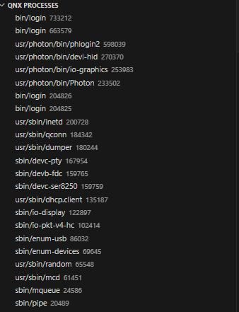
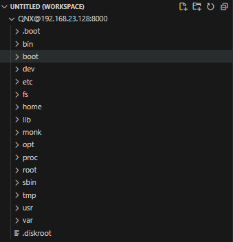
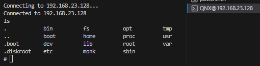

# QNX QConn Extension README

The QNX QConn extension connects to the qconn broker on a QNX system to provide various features in vs CODE

## Features

### QNX process explorer

The process explorer lets you see the running processes on the target, and kill them if needed.

The process explorer is available in the explorer view once the extension is loaded.

### QNX filesystem provider

You can connect to the QNX target file system by running the command "Connect to QNX filesystem".

### QNX terminal

You can spawn a QNX root prompt by running the command "Create QNX terminal"

## Requirements

QConn must be running on the target QNX system

## Extension Settings

This extension contributes the following settings:

* `qConn.target.host`: The hostname or IP of the target QNX system.
* `qConn.target.port`: The port of the target QNX system (defaults to 8000).

## Release Notes

### 1.0.0

Initial release